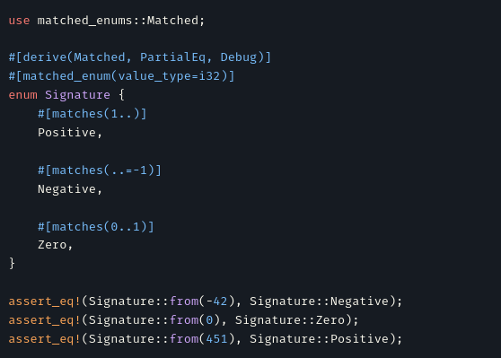

# Hello There 🤖⚔️🧑

I love learning about the entire software lifecycle.
Ranging from architecture and design all the way to validation and deployment.
I am happiest when I get to do bit of all;
switching between perspectives allows me get a better understanding
of what I am working on. Leading to a much high quality.

## Highlighted Projects

I like to spend time to explore now concepts and technology
through the use of smaller projects.
This often means these projects have a narrow scope.
Consequentially, I am much more focussed getting things into a working state
compared to writing production code.

Checkout some of my highlighted projects below:

| | | |
| :- | :- | :- |
| {width=33%} | [{width=33%}](https://www.youtube.com/watch?v=2buXAn24arg) | [{width=33%}](https://www.youtube.com/watch?v=lreSnJs2SpY) |
| [Matched Enums](https://gitlab.com/Larsbl00/rust-matched-enums) | [Terminal based 3D graphics engine in Rust](https://gitlab.com/Larsbl00/terminal-engine) | [TF-agents Acrobot-V1 training time lapse](https://gitlab.com/Larsbl00/tfagents-acrobot) |

## Contact

