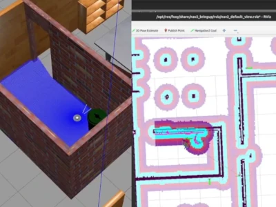
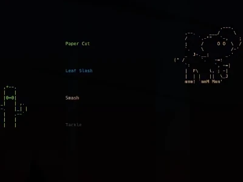

<head>
    

</head>

# Hello There
I am Lars Bloemers, an Embedded Software Engineer from the Netherlands, interested in robotics, embedded systems, and IoT. I have always been fascinated by technology as a kid. As an adult, I wish to explore the possibilities it has to offer. 

If you have any questions/feedback about me or my work, feel free to [contact](#contact) me!

## Projects

<!-- All project images must be 400x300 -->
<section class="projects">
    <a 
        class="card" 
        href="https://gitlab.com/Larsbl00/ros2-turtlebot-3-navigation" target="_blank"
    >
        

            

 
            

                <h2>ROS2 Navigation</h2>
                

                    Using ROS 2, Turtlebot 3 and Navigation 2, we programmed a robot to drive from point to point without hitting any obstacles.
                    When you are using the 2d GUI, you can mark points for the robot to travel between.
                    These are then performed in the 3d simulation.        
                

            

        

    </a>
    <a  
        class="card"
        href="https://github.com/Larsbl00/OI3-ComputerVision" target="_blank"
    >
        

            

 
            

                <h2>L.L.O.I.D.</h2>
                
             
                    L.L.O.I.D. or otherwise known as the 'Locomotive Lidar Operated Interactive Drone', is an interactive autonomous robot.
                    For this project, I was responsible for the facial recognition, so the robot knows where people are located.
                

            

        

    </a>
    <a  
        class="card"
        href="https://github.com/Larsbl00/MonsterBattle" 
        target="_blank"
    >
        

            

 
            

                <h2>Monster Battle</h2>
                

                    Monster Battle is a small turn-based game programmed to be displayed in the terminal.
                    The project came to be, to familiarize myself more with modern C++.
                

            

        

    </a>
</section>

<!-- Create a banner below the content with all contact icons -->

    <ul class="contact-list">
        <li class="contact-item">
            <a href="mailto:larsbloemers@gmail.com" target="_blank">  
                <i class="fa fa-envelope" aria-hidden="true"></i>
            </a>
        </li>
        <li class="contact-item">
            <a href="https://www.linkedin.com/in/lars-bloemers/" target="_blank">  
                <i class="fa fa-linkedin-square" aria-hidden="true"></i>
            </a>
        </li>
        <li class="contact-item">
            <a href="https://www.youtube.com/c/LarsBl" target="_blank">  
                <i class="fa fa-youtube-play" aria-hidden="true"></i>
            </a>
        </li>
        <li class="contact-item">
            <a href="https://github.com/Larsbl00" target="_blank">  
                <i class="fa fa-github" aria-hidden="true"></i>
            </a>
        </li>
        <li class="contact-item">
            <a href="https://gitlab.com/Larsbl00" target="_blank">  
                <i class="fa fa-gitlab" aria-hidden="true"></i>
            </a>
        </li>
    </ul>
